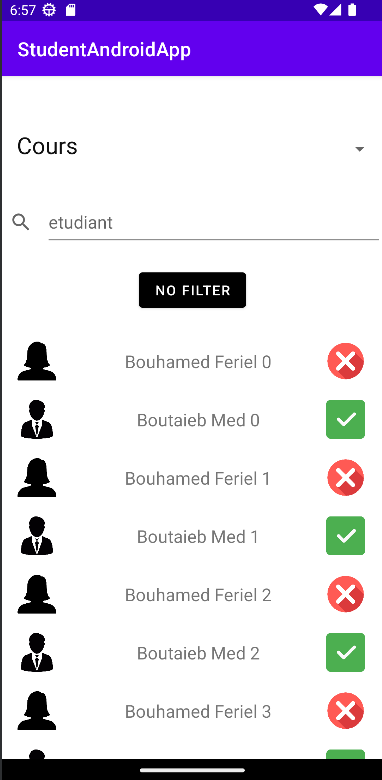

# StudentsList-Kotlin

An android app displaying different lists of students according to different criterias : ( presence
/ appearance in main course / practical activities sessions

<h2>[project demo](https://drive.google.com/file/d/1QMdN-F6XD4iADVzsx17D1swjN7-VlVgI/view?usp=sharing) </h2>

<h2>Preview</h2>
